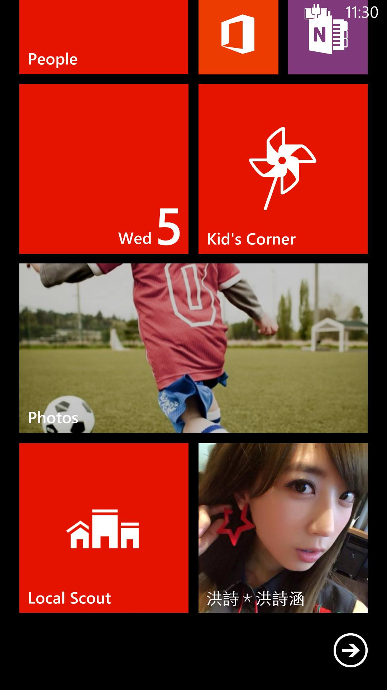
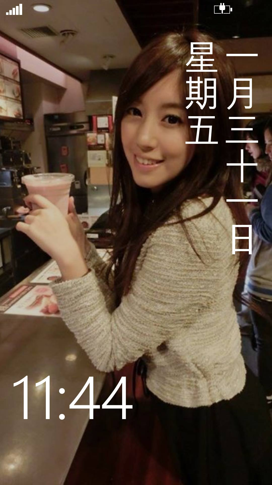

# curator-wp

因為令人尊敬的 [海總理] 開發了 [小海嚴選正妹] 的網站，所以利用了空間的時間做了一個簡單的 Windows Phone App 版本，希望藉著開放源碼的方式得到更多人的支援，或是作為想要學習 Windows Phone App 開發的參考。

## 特色

  * 支援「一天一妹」以及「正妹流」的顯示

  * 支援 Windows Phone 特色，如動態磚 (Live Tile) 或鎖定畫面 (Lockscreen) 會根據每日的正妹切換圖片。

    

    

  * 支援多國語系 (正體中文及英文)

## 編譯的準備

  * [Windows Phone 8 SDK](http://dev.windowsphone.com/downloadsdk)

    注意: 本專案是在 Windows 8.1 專業版並使用 Visual Studio 2013 所開發。(SDK 內含 Visual Studio Express 版本，可相容)

  * [nuget](http://nuget.codeplex.com/) 套件

    由於本專案使用了 [Json.NET](http://james.newtonking.com/json)，並且使用 nuget 作套件管理，編譯前需使用此工具來安裝 Json.NET 套件。

## 其它

歡迎使用本專案的 Issues 或是 Pull Requests 來協助開發，謝謝。

[海總理]: http://tzangms.com/
[小海嚴選正妹]: http://curator.im
